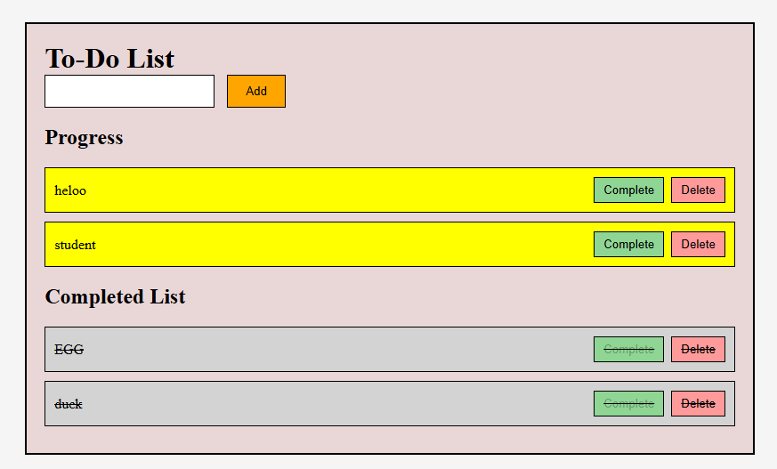

# To-Do List Web App

A simple To-Do List application built using HTML, CSS, and JavaScript.
It allows users to add tasks, mark them as completed, and delete them.

--------------------------------------------------

FEATURES

- Add new tasks
- Mark tasks as completed
- Delete tasks
- Separate sections:
  * Progress (Active tasks)
  * Completed List
- Simple and clean UI

--------------------------------------------------

SCREENSHOT

(Add your screenshot file in the project folder as "screenshot.png")

--------------------------------------------------

TECHNOLOGIES USED

- HTML
- CSS
- JavaScript (DOM Manipulation)

--------------------------------------------------

PROJECT STRUCTURE

To-Do-List/
|
|-- index.html
|-- style.css
|-- script.js
|-- screenshot.png
|-- README.md

--------------------------------------------------

HOW TO RUN

1. Clone the repository

   git clone https://github.com/darshan1-sirpi/Todo-application-JS

2. Go to the folder

   cd todo-list

3. Open index.html in browser

--------------------------------------------------

HOW IT WORKS

- Enter a task and click "Add"
- Task appears in Progress section
- Click "Complete" to move it to Completed List
- Click "Delete" to remove the task

--------------------------------------------------

FUTURE IMPROVEMENTS

- Add Local Storage (save tasks permanently)
- Edit task feature
- Dark mode
- Mobile responsive design

--------------------------------------------------

AUTHOR

Darshan Satish Patgar

--------------------------------------------------

