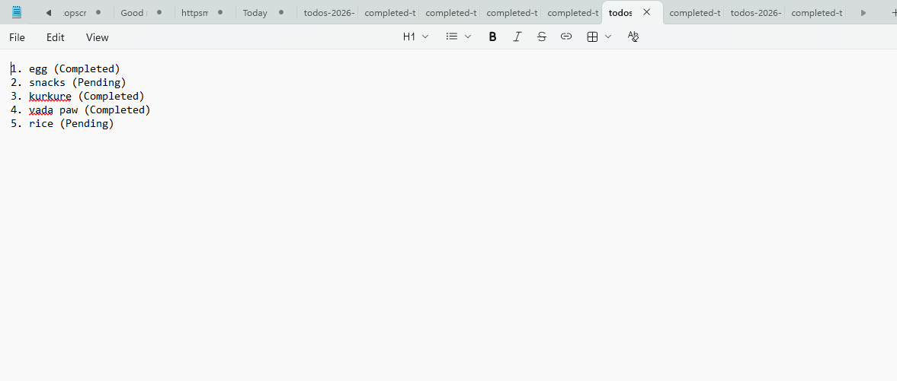

# To-Do List Web App

A simple To-Do List application built with HTML, CSS, and JavaScript. It lets users add tasks, complete them, delete them, save them in the browser, and download task lists.

## Features

- Add new tasks
- Mark tasks as completed
- Delete tasks
- Save data in local storage so tasks remain after refresh
- Download all tasks as a text file
- Download only completed tasks as a separate text file
- Separate task sections for Progress and Completed List

## Screenshots




## Technologies Used

- HTML
- CSS
- JavaScript
- localStorage
- Blob file download

## Project Structure

```text
Todo-application-JS/
|-- index.html
|-- style.css
|-- script.js
|-- image.png
|-- screenshot.png
|-- README.md
```

## How to Run

1. Clone the repository.

   ```bash
   git clone https://github.com/darshan1-sirpi/Todo-application-JS.git
   ```

2. Open the project folder.

3. Open index.html in your browser.

## How It Works

- Enter a task and click Add.
- The task appears in the Progress section.
- Click Complete to move it to the Completed List.
- Click Delete to remove a task.
- Tasks stay saved after refresh because the app uses localStorage.
- Click Download All to download both pending and completed tasks.
- Click Download Completed to download only completed tasks.

## Author

Darshan Satish Patgar


